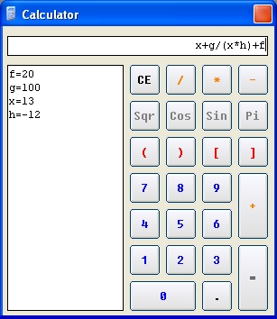



## A cool Totally skinned Calculator\*\*\*\*\*\*\*\*

### Description

This is an example how to make a COOL calculator

it could solve ANY math problem, plus, it shows how to Skin your programs, currenly running winxp Blue skin
 
### More Info
 

             |
---                |---
**Submitted On**   |2002-08-29 15:08:08
**By**             |[Leo Barsukov](https://github.com/Planet-Source-Code/PSCIndex/blob/master/ByAuthor/leo-barsukov.md)
**Level**          |Advanced
**User Rating**    |4.9 (34 globes from 7 users)
**Compatibility**  |VB 6\.0
**Category**       |[Math/ Dates](https://github.com/Planet-Source-Code/PSCIndex/blob/master/ByCategory/math-dates__1-37.md)
**World**          |[Visual Basic](https://github.com/Planet-Source-Code/PSCIndex/blob/master/ByWorld/visual-basic.md)
**Archive File**   |[A\_cool\_Tot1242988292002\.zip](https://github.com/Planet-Source-Code/leo-barsukov-a-cool-totally-skinned-calculator__1-38467/archive/master.zip)

